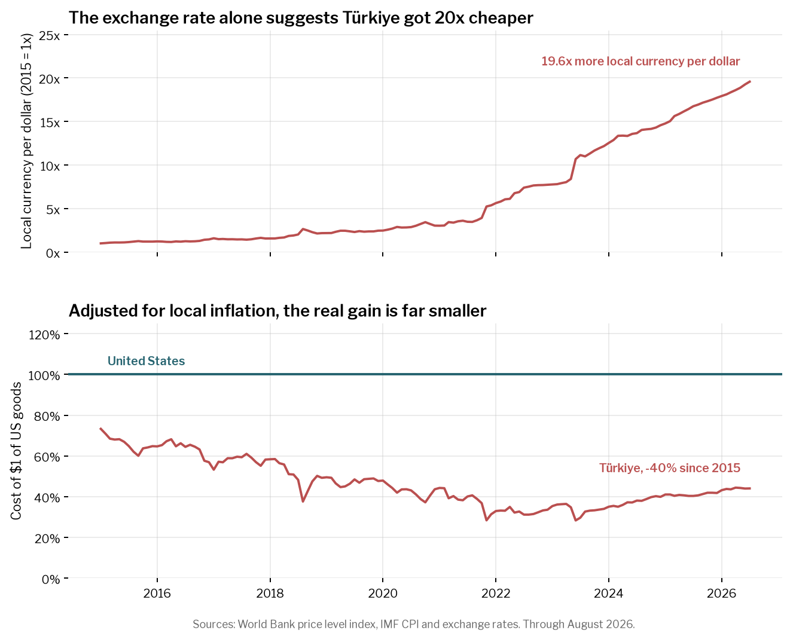

# Real Travel Cost

Where is it "cheap" to travel internationally? Where is it currently cheaper to travel
compared to previous years?

Answering these questions is challenging because we need to know the prices in a foreign
country adjusting for the exchange rate. Although the World Bank provides a
[metric](https://data.worldbank.org/indicator/PA.NUS.PPPC.RF) "Price level ratio of PPP
conversion factor (GDP) to market exchange rate" that captures this information, the
trend faces a >1 year lag, which may be unhelpful for taking advantage of recent
changes in relative prices.

Note that it may be tempting to examine exchange rates, which are readily available in
real time, and think that a large increase in the dollar-to-foreign-currency exchange
rate implies cheaper travel. Turkiye is the clearest case: since 2015 the dollar has
bought roughly **20x** more lira.

<figure class="image" style="text-align: center">
  
  <figcaption>
    A collapsing currency (top) against what a dollar actually buys (bottom)
  </figcaption>
</figure>

Such a trend does **not** mean holders of dollars can now consume 20x more when visiting
Turkiye. This is because _prices have also increased_ (i.e., inflation), and the two very
nearly cancel. Netting local inflation out, travel to Turkiye is about **40% cheaper**
than in 2015 — a real gain, but a far cry from the 20x the exchange rate implies.

That second panel is the metric this repo computes, for every country, monthly.

## Data

To get as close to real-time data as possible, I use the following sources (all public APIs or included in repo)

1. IMF SDMX API (`api.imf.org`):
   1. `CPI` — country-month consumer price index, 2010 = 100.
   2. `ER` — country-month local-currency-per-USD exchange rates, end of period.
2. State Department travel advisory RSS: current advisory levels (1 to 4).
3. World Bank PPP conversion factors for 2020, bundled in the repo.

## Usage

```bash
uv sync --extra notebook
uv run jupyter lab notebooks/real-travel-cost.ipynb
```

```python
import real_travel_cost as rtc

panel = rtc.load_panel()  # fetches once, then caches to ~/.cache/real_travel_cost
rtc.rank_latest(panel).head(10)  # cheapest countries at advisory level 1-2
rtc.rank_change(panel, "2015-07-01", "2025-07-01")
```

`load_panel()` returns one row per country-month. The headline column is `current_dollars`:
the dollars needed abroad to buy what $1 buys in the US today, so below 1.0 means a dollar
goes further there.

Regenerate the README figure with `rtc.plot_devaluation_vs_real_cost(panel)`, which takes
any `country_code` and defaults to Turkiye.

## Development

```bash
uv run pytest
uv run ruff check .
```
